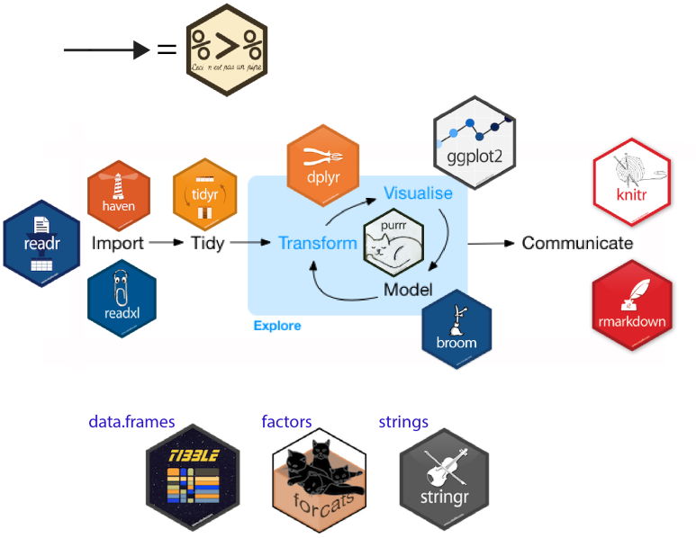

```{r setup, include=FALSE}
knitr::opts_chunk$set(echo = TRUE,
                      warning = FALSE,
                      message = FALSE,
                      out.width = "50%")
```

# 데이터분석 프로세스

데이터분석 혹은 데이터사이언스의 업무 진행 과정은 다음과 같습니다.

```{r fig.cap='데이터분석 프로세스', echo = FALSE}
knitr::include_graphics('images/ds_flow.png')
```


R 내에서 이러한 데이터 분석을 편하게 하기 위해서는 tidyverse 패키지가 만들어 낸 생태계를 이해할 필요가 있습니다. tidyverse란 R studio에서 만든 패키지 중 핵심 패키지들을 묶은 Package of Packages 입니다.

- https://www.tidyverse.org/

데이터 과학에서 업무 과정 별 사용되는 패키지는 다음과 같습니다.

```{r fig.cap='tidyverse', echo = FALSE}

```

## 데이터 불러오기

회사의 서버에 저장된 데이터를 불러와야 데이터 분석을 할 수 있습니다. 그러나 실무에서는 그보다 먼저 데이터의 수집 및 어떤 플랫폼에 저장할 지 제대로 정의해야, 수월한 데이터 분석을 수행할 수 있습니다.

### 데이터 수집 및 저장

제대로 된 데이터가 있어야 제대로 된 분석을 할 수 있습니다. 데이터 구매를 위해 비싼 비용을 사용하지만, 대부분의 데이터가 완벽하다고 말할 수는 없습니다. 해외 금융회사의 경우 여러 벤더로부터 데이터를 구매한 후 크로스체크를 통해 오류가 있는 데이터를 찾아내며, 주니어 퀀트의 경우 데이터 오류 검증을 하는 업무부터 시작해 나갑니다.